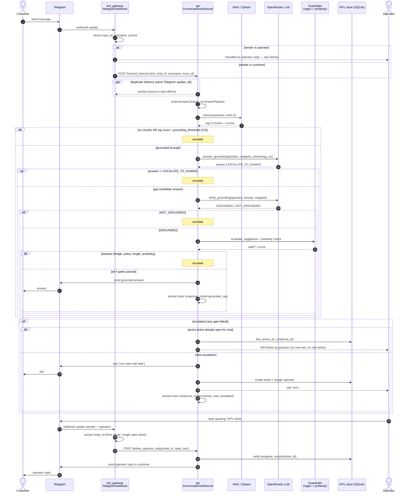

# Dialog Pipeline — Customer ↔ Bot

UML sequence (interaction) diagram of one customer message traveling end-to-end:
Telegram ingress → answer pipeline → either a grounded answer or HITL escalation,
and the operator reply path back to the customer.

> Reflects current code: the pipeline runs a single `GroundedRagAnswerer`.
> Date/holiday/weather are no longer answerers — they are folded into the
> scheduling context passed to the grounding LLM.

## In plain English

A walkthrough of the same flow, no jargon:

**Getting the message in**
1. The customer types a message to the bot in Telegram.
2. Telegram forwards it to our `bot_gateway` as a webhook.
3. The gateway tags the message with a trace id (so we never process the same one twice), cleans it up, and saves it.
4. It checks who sent it. If it's the human operator, it's treated as a reply (jump to the operator section). If it's a customer, it's sent on to the `api` to be answered.

**Trying to answer automatically**
5. If this is a duplicate delivery of the same Telegram message (a retry — same `update_id`, not just the same wording typed again), we return the earlier result and stop. A genuinely new message — even identical text asked later — is always answered fresh, so context-dependent answers like prices stay correct.
6. The `api` looks up the customer's question in our knowledge base (RAG/Qdrant) and pulls the 3 closest matching snippets.
7. If nothing matches well enough (no snippets, or the best one is too weak), we give up on auto-answering and escalate to a human.
8. Otherwise we ask the LLM to write an answer using **only** those snippets. If the LLM can't answer honestly from them, it returns a special "escalate to human" signal.
9. We then ask a second LLM to fact-check that answer against the snippets — does the answer actually follow from the source? If not, escalate.
10. Finally we run safety checks: no waffling/hedging, no policy violations, no profanity. If anything trips, escalate.
11. If the answer clears all four checks, the bot sends it to the customer and records what happened.

**Handing off to a human (escalation)**
12. If the customer already has an open support ticket, we don't bother them with another "we'll help you" message or open a duplicate — we just forward the new question to the operator.
13. For a fresh issue: the bot sends a quick acknowledgement ("our team will help"), opens a ticket, assigns it to an operator, and DMs that operator the customer's exact question.

**The operator answers back**
14. The operator replies in Telegram, quoting the ticket so we know which one it's for.
15. The gateway figures out the ticket id (from the quote, or the only open ticket) and passes the reply to the `api`.
16. The `api` confirms the operator owns that ticket, marks it resolved, and sends their reply to the customer.

## Participants

| Participant | Role |
|---|---|
| Customer | End user on Telegram |
| Telegram | Webhook transport in, send-message out |
| bot_gateway | Validate → normalize → persist → branch by sender |
| api | Builds `AnswerContext`, runs `AnswerPipeline`, owns HITL orchestration |
| RAG / Qdrant | Top-3 chunk retrieval with similarity scores |
| OpenRouter LLM | Two calls: grounded answer, then grounding verifier |
| Guardrails | Regex hedge/policy check + Russian profanity filter |
| HITL store | Ticket create / assign / find-active / resolve |
| Operator | Human who answers escalated questions |

## The four grounding gates

A candidate answer reaches the customer only if it clears, in order:

1. **Retrieval** — chunks exist and top score ≥ `grounding_threshold` (0.6).
2. **Strict-grounding LLM** — answer is not the `ESCALATE_TO_HUMAN` sentinel.
3. **LLM verifier** — second LLM judges the answer `GROUNDED` against snippets.
4. **Guardrails** — passes regex (hedge/policy/length) and profanity checks.

Failing any gate routes to HITL: ack the customer, create + assign a ticket,
and DM the operator the verbatim question. A follow-up while a ticket is already
open is coalesced — no second ack, no second ticket.
